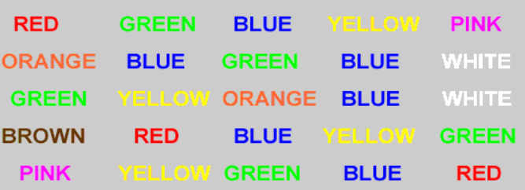
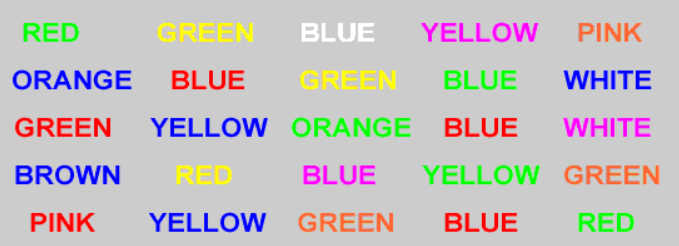

# Analyzing the Stroop Effect

## Table of Contents

* [Description](#description)
* [Tools & Dependencies](#tools)
* [Installation](#installation)
* [Contributing](#contributing)
* [License](#license)

## Description

In a Stroop task, participants are presented with a list of words, with each word displayed in a color of ink. The participant’s task is to say out loud the color of the ink in which the word is printed. 

The task has two conditions: a congruent words condition, and an incongruent words condition. In the **congruent words condition**, the words being displayed are color words whose names match the colors in which they are printed: 



In the **incongruent words condition**, the words displayed are color words whose names do not match the colors in which they are printed:



In each case, we measure the time it takes to name the ink colors in equally-sized lists. Each participant will go through and record a time from each condition.

You can try out the Stroop task for yourself by going to the [Interactive Stroop Effect Experiment](https://faculty.washington.edu/chudler/java/ready.html), which is a Java-based applet for performing the Stroop task.


## Tools & Dependencies

The data in this repository was provided by the Udacity.com as part of their Data Analyst for Enterprise nanodegree.

The data is stored in the `/data/` folder of the project files.

Analysis has been performed in the [Jupyter Notebook](http://jupyter.org/), using Python 3.x.  


## Installation

To run this project:
  
1. With python 3.x installed, create a virtual environment and activate it as shown:
  
```shell
  virtualenv -p python3 my_virtualenv
  source my_virtualenv/bin/activate
```
2. Clone this repository into your virtual environment:  

```shell
git clone https://github.com/BarbaraStempien/DA--Analyzing-the-Stroop-Effect.git
```
3. Install project dependencies:  

```shell
pip install -r DA--Analyzing-the-Stroop-Effect/requirements.txt
```
  
4. Open Jupter Notebook, and run the project.

## Contributing

If you want to contribute, check out [CONTRIBUTING.md](CONTRIBUTING.md).

## License

[MIT License](LICENSE)

Copyright (c) 2018 Barbara Stempien

Permission is hereby granted, free of charge, to any person obtaining a copy of this software and associated documentation files (the "Software"), to deal in the Software without restriction, including without limitation the rights to use, copy, modify, merge, publish, distribute, sublicense, and/or sell copies of the Software, and to permit persons to whom the Software is furnished to do so, subject to the following conditions:

The above copyright notice and this permission notice shall be included in all copies or substantial portions of the Software.

THE SOFTWARE IS PROVIDED "AS IS", WITHOUT WARRANTY OF ANY KIND, EXPRESS OR IMPLIED, INCLUDING BUT NOT LIMITED TO THE WARRANTIES OF MERCHANTABILITY, FITNESS FOR A PARTICULAR PURPOSE AND NONINFRINGEMENT. IN NO EVENT SHALL THE AUTHORS OR COPYRIGHT HOLDERS BE LIABLE FOR ANY CLAIM, DAMAGES OR OTHER LIABILITY, WHETHER IN AN ACTION OF CONTRACT, TORT OR OTHERWISE, ARISING FROM, OUT OF OR IN CONNECTION WITH THE SOFTWARE OR THE USE OR OTHER DEALINGS IN THE SOFTWARE.
